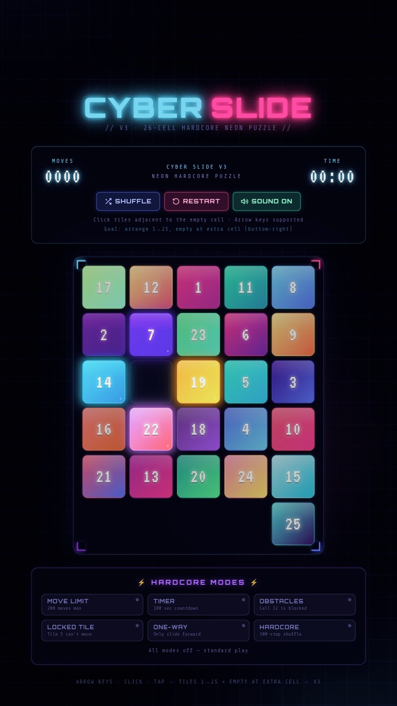

  

<h1 align="center">Hi 👋, I'm Ansil Muhammed N S</h1>
<h3 align="center">Experimentalist | B.Tech CSE Student </h3>

  

 </a>
 

## 💫 About Me

- 🔭 I'm currently working on **building modern, responsive web applications.**
- 🌱 I'm currently learning **Python, C, and integrating AI-powered development workflows.**
- 👯 I'm looking to collaborate on **open-source frontend projects and hackathons.**
- 🤝 I'm looking for help with **building scalable architectures and mastering UI/UX design principles.**
- 💬 Ask me about **frontend design, vibe coding, and building things from scratch.**

 </a>
 

## 🌐 Connect with Me

  
  
  
  

  
  
  

 </a>
 

## 💻 Tech Stack

  

 </a>

## 🚀 Featured Projects

<table align="center">
  <tr>
    <td width="50%" valign="top">
      <h3 align="center">🕹️ Reiatsu </h3>
      

        
      

      

        A high level webcam experience with mediapipe.
      

      

        
        
        
      

      

        
        
      

    </td>
    <td width="50%" valign="top">
      <h3 align="center">🕹️ Cyber Slide</h3>
      

        
      

      

        CyberSlide is a classic sliding puzzle wrapped in a cyberpunk neon aesthetic
      

      

        
        
        
      

      

        
        
      

    </td>
  </tr>
  <tr>
<!--    <td width="50%" valign="top">
      <h3 align="center">🕹️ Project Name</h3>
      

        
      

      

        Short description of what this project does and what makes it cool.
      

      

        
        
        
      

      

        
        
      

    </td>
    <td width="50%" valign="top">
      <h3 align="center">🕹️ Project Name</h3>
      

        
      

      

        Short description of what this project does and what makes it cool.
      

      

        
        
        
      

      

        
        
      

    </td>
  </tr>
    -->
</table>

 </a>

## 📊 GitHub Stats & Activity

  
  

  

  

 </a>
 

## ✍️ Random Dev Quote

  

 </a>
 

##  💭 My Quote

> **"FAKE IT TILL YOU MAKE IT"**
